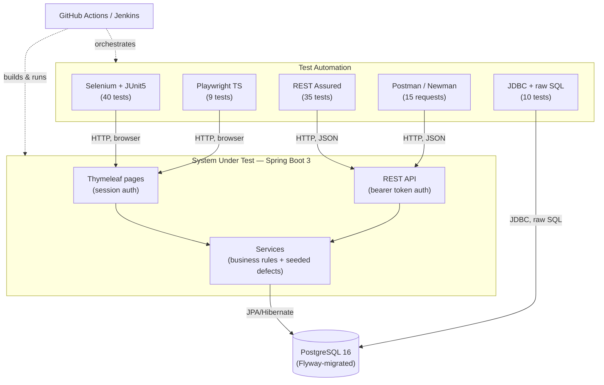
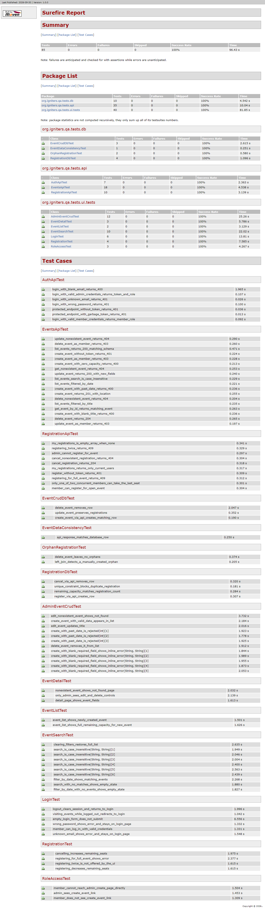
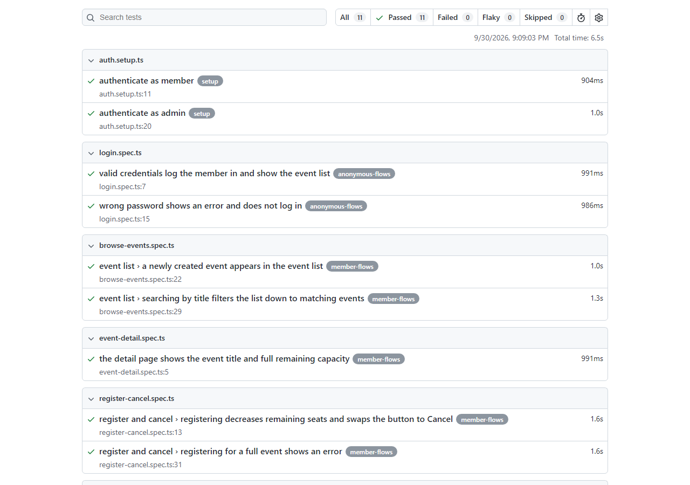
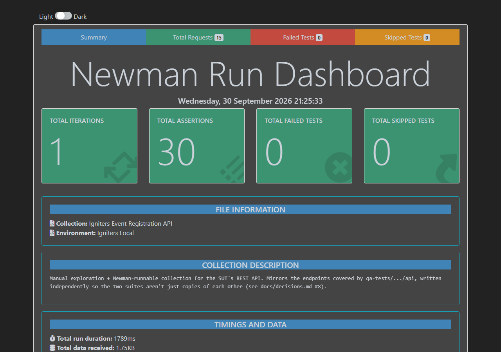

# Igniters QA Automation

[](https://github.com/arunchacko1/igniters-qa-automation/actions/workflows/ci.yml)

A QA automation portfolio project: a small event-registration app for a
youth group (the **System Under Test**), tested end-to-end with Selenium,
Playwright, REST Assured, Postman/Newman, and JDBC — wired into CI/CD with
GitHub Actions and Jenkins, and documented the way a QA engineer actually
plans and reports work (test plan, test cases, traceability matrix, bug
reports). **85 Java tests + 9 Playwright tests + a 15-request Postman
collection, all green.**

## Skills → Evidence

| Skill | Where | Note |
|---|---|---|
| Test automation, functional/regression/smoke testing | `qa-tests/src/test/java/.../ui`, `.../api` | `@Tag("smoke")`/`@Tag("regression")` on every Selenium/API test; Maven profiles select which run. |
| Integration testing | `qa-tests/.../db/EventDataConsistencyTest.java` | Compares the live API response against the database row behind it. |
| Java, JUnit 5, Maven | `qa-tests/pom.xml`, all of `qa-tests/src` | Multi-module reactor (`pom.xml` at root), 4 Maven profiles. |
| Selenium WebDriver | `qa-tests/.../ui` | Page Object Model, explicit waits only, screenshot-on-failure, 3 `@ParameterizedTest` groups, 40 tests. |
| Playwright (TypeScript) | `playwright-tests/` | Page Object Model, `storageState` session reuse, trace-on-first-retry, 9 tests. |
| REST API testing — REST Assured | `qa-tests/.../api` | All 8 endpoints, positive + negative paths, JSON schema validation, shared request specs. 35 tests. |
| REST API testing — Postman | `postman/` | Folders per resource, chained requests (login → token → create → register → cancel → delete), run with Newman in CI. |
| SQL (PostgreSQL), data integrity | `qa-tests/.../db`, `docs/sql-cheatsheet.md` | Plain JDBC, no ORM — unique-constraint test, orphan-row `LEFT JOIN`, 10 tests. |
| Git & GitHub workflow | this repo's commit history | One commit per phase, `type(scope): message` style, GitHub Issue templates. |
| CI/CD — GitHub Actions | `.github/workflows/ci.yml` | 5 jobs, parallel where safe, Postgres service container, artifacts on every run. |
| CI/CD — Jenkins | `Jenkinsfile`, `docs/jenkins-setup.md` | Same stages as the GH Actions workflow, for a Docker-based Jenkins agent. |
| Docker & cloud concepts | `docker-compose.yml`, `sut-app/Dockerfile`, `docs/cloud-notes.md` | Multi-stage build; cloud-notes maps the setup onto a real deployment. |
| Agile/Scrum artifacts | `docs/sprint-notes.md` | 3 sprints — goal, stories done, retro note. |
| Test planning, requirement review, defect tracking | `docs/test-plan.md`, `docs/requirements.md`, `docs/bug-reports/` | 13 user stories, 56 test cases, 5 bug reports (one per seeded defect). |

## Architecture



## Quick Start

```bash
git clone https://github.com/arunchacko1/igniters-qa-automation.git
cd igniters-qa-automation
cp .env.example .env
./scripts/start.sh      # builds and starts Postgres + the SUT
./scripts/run-tests.sh  # runs every suite: Selenium+REST Assured+JDBC, Playwright, Newman
```
(Or just `./scripts/run-all.sh` to do both in one command.) The app itself is
then at `http://localhost:8080` — log in as `avery.admin@igniters.org` /
`Passw0rd!` (admin) or `jordan.member@igniters.org` / `Passw0rd!` (member).

## Running Each Suite Individually

```bash
# Selenium + REST Assured + JDBC (Maven profiles)
./mvnw -f qa-tests/pom.xml test -Psmoke       # fast critical-path subset
./mvnw -f qa-tests/pom.xml test -Pregression  # smoke + regression tagged
./mvnw -f qa-tests/pom.xml test -Papi         # every REST Assured test
./mvnw -f qa-tests/pom.xml test -Pdb          # every JDBC test
./mvnw -f qa-tests/pom.xml test               # no profile = everything (85 tests)

# Playwright
cd playwright-tests && npm ci && npx playwright install chromium && npx playwright test

# Postman / Newman
npx newman run postman/igniters-collection.json -e postman/igniters-environment.json
```

## Enabling the Seeded Defects

Five deliberate bugs are gated behind one environment variable:

```bash
QA_DEFECTS_ENABLED=true ./scripts/start.sh
```

With it `true`: capacity allows one extra registration, search becomes
case-sensitive, deleting an event orphans its registrations, `PUT` on a
missing event id returns 200 instead of 404, and the create-event web form
accepts a past date the API still rejects. Every one of those is caught by
an automated test — see `docs/bug-reports/` for the full repro steps per bug,
and `docs/decisions.md` for why the defects are implemented as single
`if (qaDefectsEnabled)` branches next to the correct logic rather than a
separate code path.

## CI/CD

The badge at the top links to the latest GitHub Actions run. Five jobs:
**Build** (packages the SUT once), then **Smoke** (every push), **Regression**
(PRs + nightly cron), **Playwright**, and **Newman** — the last three run in
parallel off the same built jar. Every job uploads its reports/screenshots/
traces as artifacts, pass or fail. The `Jenkinsfile` runs the same stages for
a Docker-based Jenkins agent (`docs/jenkins-setup.md`).

## Reports





(Generate these yourself with `./mvnw -f qa-tests/pom.xml surefire-report:report-only`,
`npx playwright show-report`, and Newman's `--reporters cli,htmlextra` flag.)

## Selenium vs. Playwright: What I Learned

Writing the same critical flows twice, in two frameworks, made the
differences concrete instead of theoretical:

- **Waiting.** Selenium's `WebDriverWait` + `ExpectedConditions` is explicit
  and manual — you write the wait, you pick the condition. Playwright's
  locators auto-wait for actionability (visible, stable, enabled) before
  every action, so most Playwright tests needed zero explicit waits at all.
  That auto-waiting also hides a class of bugs Selenium forces you to
  confront directly — see the next point.
- **The "click returns before navigation lands" race.** This bit the
  Selenium suite three separate times (login, logout, search) before I
  added explicit post-navigation waits everywhere a click triggers a
  redirect. The Playwright suite never hit it — `page.waitForURL()` /
  locator auto-waiting absorbs it by default.
- **`<input type="date">`.** Selenium's `sendKeys("2026-10-10")` types into
  a segmented native date widget one character at a time and routinely
  produces garbage; I had to set the value via JavaScript instead.
  Playwright's `locator.fill()` sets the value directly and never hit this.
- **Session reuse.** Both frameworks support it, but Playwright's
  `storageState` + dependent "setup" project is a first-class, documented
  pattern. The Selenium equivalent (reusing a serialized session/cookie
  across tests) is something you wire up yourself.
- **Where each earns its place here.** Selenium is the primary suite
  because it's the more commonly-required skill on QA job postings and
  forces you to understand *why* a wait is needed, not just that one
  happens automatically. Playwright is the secondary suite because for
  everyday authoring speed and flake-resistance, it's hard to beat.

## What I Would Add Next

- **Performance tests** (e.g. k6 or Gatling) against the `/api/events`
  endpoint under load — nothing here measures response time under
  concurrency, only correctness.
- **Contract tests** (e.g. Pact) between the API and a hypothetical mobile
  client, so a breaking API change would fail CI before it reaches a real
  consumer.
- **Accessibility checks** (axe-core) on the Thymeleaf pages — explicitly
  out of scope per `docs/test-plan.md`, but a natural next layer.
- **A deployed staging environment** — `docs/cloud-notes.md` lays out the
  plan (registry + managed Postgres + compute service); actually standing
  one up and pointing the smoke suite at it is the logical next step.
- **Allure reporting** — Surefire HTML was the pragmatic choice for a
  zero-extra-tooling setup (`docs/decisions.md` #1); Allure's richer,
  interactive report would be a nice upgrade once the project has a reason
  to carry that extra dependency.

## Repository Structure

See the top of this file's skills table for what lives where. The short
version: `sut-app/` is the application, `qa-tests/` is the Java test suites,
`playwright-tests/` is the TypeScript suite, `postman/` is the Postman
collection, `docs/` is everything a QA engineer would write before and
around the code, and `scripts/` is the one-command local runner.

Further reading: `docs/decisions.md` (why things are built this way),
`docs/interview-notes.md` (likely interview questions about this project),
`docs/resume-bullets.md`.
